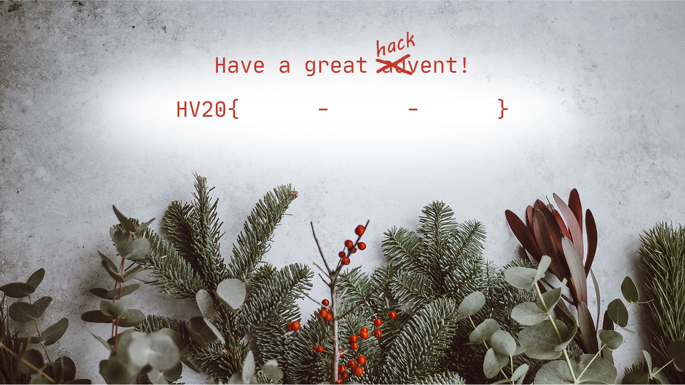
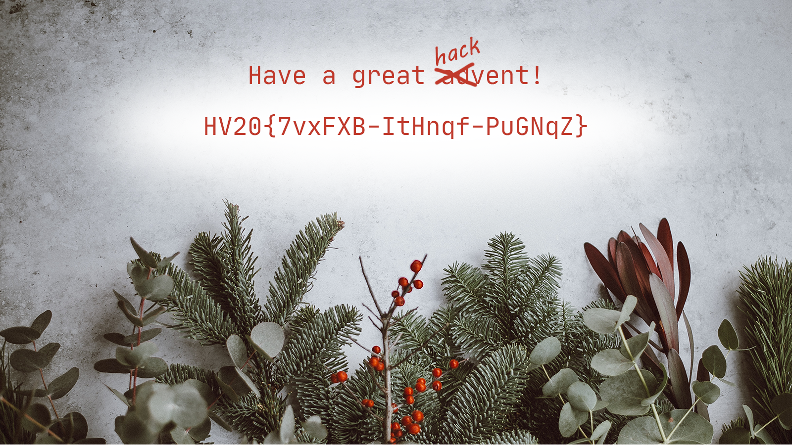

# HV20.01 Happy HACKvent 2020

An invitation card is provided with the code "hidden" behind black rectangles. 

The black rectangles come from alpha channel manipulations. Setting the alpha channel to opaque may resolve the hidden flag:

Image Magick tool:

    convert card.png -channel A -fx 255 card_no_alpha.png

    
The resulting code readable from the generated `card_no_alpha.png` is:

    HV20{7vxFXB-ItHnqf-PuGNqZ}

Another variant to solve this problem is by using the [solve.py](solve.py) Python script to generate [solved.png](solved.png).
