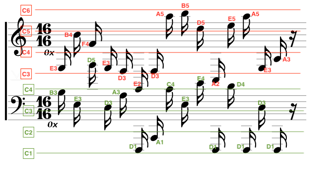

# HV20.11 Chris'mas carol

  

---

## Introduction

Since yesterday's challenge seems to have been a bit on the hard side, we're adding a small musical innuendo to relax.

My friend Chris from Florida sent me this score. Enjoy! Is this what you call postmodern?

P.S: Also, we're giving another 24h to get full points for the last challenge.

**Hints**

- He also sent this [image](skyline.png), but that doesn't look like Miami's skyline to me.
- The secret code is useful for a file - not a website

---

## Analysis

The score seems to be one or two keys encoded using notes: 16/16 and the `0x` prefix seems to indicate that it's about hexadecimal encoding with a key length of 16. Interestingly there are sometimes two notes of the same clef.

The image in the hint can be resolved using reverse image search [TinEye](tineye.com) to an [Online steganography service](https://www.mobilefish.com/services/steganography/steganography.php). So we conclude, that the score image and the notes on it can be used to decrypt the flag!

So the first challenge will be to decode the notes on the score.
With the help of a scientifi pitch notation of the C octaves, it was possible to decode the trebble and bass clefs by anotating the image:

 - trebble clef: 
 
        E3 B4 F4 E3 D3 E2 D3 A5 B5 D5 A2 E5 A5 E3 A3

 - bass clef: 
 
        B3 E3 D5 D3 A3 D1 A1 C4 E3 E4 D1 D4 D1 D3 D1

Nevertheless above keys cannot be used to decrypt the steganography in the image. Trying to without a password results in a `flag.zip` wich is probably encrypted.

To decompress the `flag.zip` we cannot use the regular `unzip` command. We have to install the `7z` tools.

To get a password out of the trebble and bass clef, XOR jumps to my mind. Combining those two (using [CyberChef again](https://gchq.github.io/CyberChef/)) gives a nearly readably password:

    PW!0p3raV1s1t0r

Applying this password to `7z x -y flag.zip` results in `flag.txt` containing:

    HV20{r3ad-th3-mus1c!}
