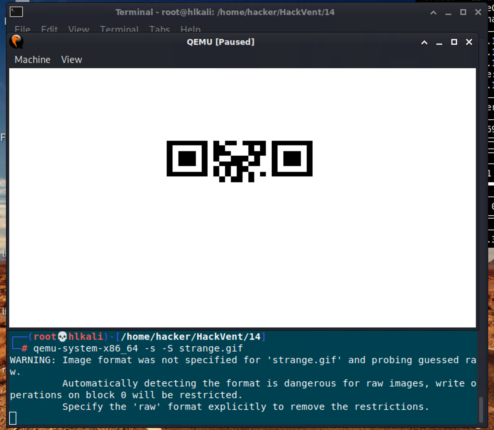
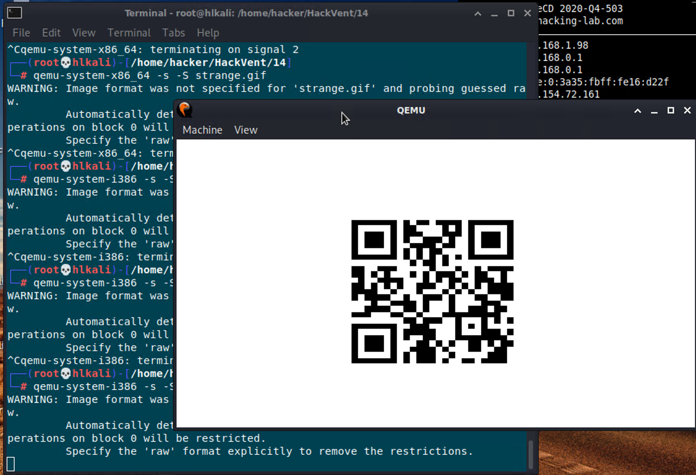

# HV20.14 Santa's Special GIFt

  

---

## Introduction

Today, you got a strange GIFt from Santa:

You are unsure what it is for. You do happen to have some wood lying around, but the tool seems to be made for metal. You notice how it has a rather strange size. You could use it for your fingernails, perhaps? If you keep looking, you might see some other uses...

---

## Analysis

Opening the strange GIF in Wireshark, shows three "Comment" sections. Possibly leading to the data used for the flag?

Using the command `file -k strange.gif` we get the following possible file types:

    strange.gif: GIF image data, version 89a, 128 x 16
    - DOS/MBR boot sector
    -  DOS/MBR boot sector
    - data

Yeah... this can be a valid boot sector. And the size of 512 bytes is really indicating, that it might be some disk sector.

After unsuccessfully fiddling with Hyper-V, WSL and an outdated Ubuntu Desktop, I came back to HL LiveCD (Kali linux) with QEMU. 
Running `qemu-system-i386 strange.gif` opens a window which shows part of a QR-Code. I wonder how we should fix this...

  

So we will now use QEMU with the debugging options to allow GDB attach to the process:

    qemu-system-i386 -s -S strange.gif

Start GDB:

    gdb vmlinux

And connect to the debugging session:

    (gdb) target remote localhost:1234
    (gdb) layout asm
    (gdb) c

Abort current execution by pressing `CTRL+C`.

Looking at the current execution location:

    (gdb) x/10i $cs*16+$eip-10
        0x7c59:      jne    0x7c79
        0x7c5b:      cmp    $0x27500e0,%esi
        0x7c61:      cli
        0x7c62:      hlt
     => 0x7c63:      mov    $0x10cd0e0d,%eax
        0x7c68:      mov    $0xa,%al
        0x7c6a:      int    $0x10
        0x7c6c:      mov    $0x20b0001b,%ecx
        0x7c71:      int    $0x10
        0x7c73:      dec    %ecx

The program was "halted" by the `hlt` command. Let's try to skip this by setting a breakpoint and incrementing the execution pointer manually.

1. Disconnect GDB:

    (gdb) disconnect

2. Stop and restart QEMU:

    CTRL+C
    qemu-system-i386 -s -S strange.gif

3. Reconnect GDB, set a break point and continue execution:

    (gdb) target remote localhost:1234
    (gdb) break *0x7c62
    (gdb) c

The debugger will automatically stop just before the `hlt` instruction. To skip it, we set EIP to the next valid instruction and continue:

    (gdb) set $eip = 0x7c63
    (gdb) c

QEMU is now showing the full QR-Code:

  

## Solution

    HV20{54n74'5-m461c-b00t-l04d3r}