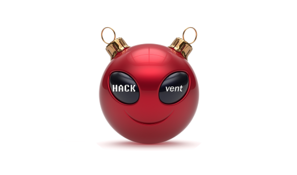

# HACKvent 2020 - The hackers advent

This "capture the flag" hacking event took place from November 29th to 31st of December 2020. 
There were 1170 participants registered, trying to solve 29 hacking challenges in increasing difficulty. 
622 users have submitted at least 1 flag successfully (=minimum 90 points). The perfect scorers (27 users!) had 6100 points. 

I've completed 15 of the 29 challenges, earning me 2210 points and ending on rank 72.

- [Competition Website](https://competition.hacking-lab.com/events/1)
- [Official ranking](https://ranking.competition.hacking-lab.com)
- [Detailed stats](https://hackvent-stats.herokuapp.com)

## Write-up

- HV20.-1 Twelve steps of christmas
  
    
  [my solution](-1/)

- HV20.01 Happy HACKvent 2020
  
    
  [my solution](01/)

- HV20.02 Chinese Animals
  
    
  [my solution](02/)

- HV20.03 Packed gifts
  
    
  [my solution](03/)

- HV20.04 Br❤️celet
  
    
  [my solution](04/)

- HV20.05 Image DNA
  
  
    
  [my solution](05/)

- HV20.06 Twelve steps of christmas
  
    
  [my solution](06/)

- HV20.07 Bad morals
  
  
    
  [my solution](07/)

- HV20.08 The game
  
  
    
  [my solution](08/)

- HV20.09 Santa's Gingerbread Factory
  
  
    
  [my solution](09/)

- HV20.10 Be patient with the adjacent
  
    
  [my solution](10/)

- HV20.11 Chris'mas carol
  
  
    
  [my solution](11/)

- HV20.12 Wiener waltz
  
    
  [my notes](12/)

- HV20.13 Twelve steps of christmas
  
  
    
  [my notes](13/)

- HV20.14 Santa's Special GIFt
  
  
    
  [my solution](14/)

- HV20.15 Man Commands, Server Lost
  
  
    
  [description](15/)

- HV20.16 Naughty Rudolph
  
  
    
  [description](16/)

- HV20.17 Santa's Gift Factory Control
  
  
    
  [description](17/)

- HV20.18 Santa's lost home
  
  
  
    
  [description](18/)

- HV20.19 Docker Linter Service
  
  
    
  [description](19/)

- HV20.20 Twelve steps of Christmas
  
  
  
    
  [description](20/)

- HV20.21 Threatened Cat
  
  
    
  [description](21/)

- HV20.22 Padawanlock
  
    
  [description](22/)

- HV20.23 Those who make backups are cowards!
  
  
    
  [description](23/)

- HV20.24 Santa's Secure Data Storage
  
  
  
  
    
  [description](24/)

---

- HV20.H1 It's a secret!
  
    
  [my solution](H1/)

- HV20.H2 Oh, another secret!
  
    
  [my solution](H2/)

- HV20.H3 Hidden in Plain Sight
  
    
  [description](H3/)

